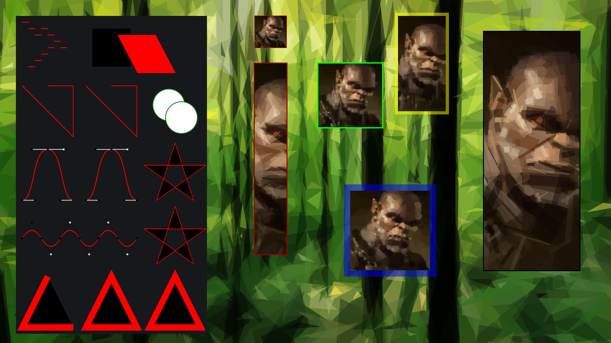

# svglover

A library to import and display simple SVGs in [LÖVE](http://love2d.org/).

Note that because it is specifically written for LÖVE, it is probably not useful
for other [Lua](http://www.lua.org/) environments.

If you really want to squash your SVGs, try running them through
[SVGO](https://github.com/svg/svgo) and/or gzipping them.

The latest code can always be found at
[Github](https://github.com/globalcitizen/svglover).

## News

* 2017-05-30:
    [v1.0.5](https://github.com/globalcitizen/svglover/releases/tag/v1.0.5)
    released!
  - Normalize internal function naming / reduce potential namespace collision
      issues

* 2016-10-02:
    [v1.0.4](https://github.com/globalcitizen/svglover/releases/tag/v1.0.4)
    released!
  - Fix compatibility issue by moving from basic Lua IO functions to 100% Love
      filesystem functions

* 2016-10-02:
    [v1.0.3](https://github.com/globalcitizen/svglover/releases/tag/v1.0.3)
    released!
  - Allow automatic / transparent loading of gzip compressed SVG files
  - Add zoom feature

* 2016-10-02:
    [v1.0.2](https://github.com/globalcitizen/svglover/releases/tag/v1.0.2)
    released!
  - Fix Lua logic error that was stopping fill-related scaling from working
      properly

* 2016-09-27:
    [v1.0.1](https://github.com/globalcitizen/svglover/releases/tag/v1.0.1)
    released!
  - Add `<circle>` support (when circles are not drawn as `<ellipse>`)
  - Slightly hardier parsing
  - Improved documentation

* 2016-09-27:
    [v1.0.0](https://github.com/globalcitizen/svglover/releases/tag/v1.0.0)
    released!
  - Basic functionality

## Features

* Supports the following elements:
  - `<circle>`
  - `<ellipse>`
  - `<g>`
  - `<path>` (no support for ArcTo yet)
  - `<polygon>`
  - `<polyline>`
  - `<rect>`
  - `<use>`

* Supports the following attributes:
  - `id`, `href`, `xlink:href`, `x`, `y`, `width`, `height`, `cx`, `cy`, `r`,
      `rx`, `ry`, `d`, `points`
  - `transform` (with support for `translate`, `rotate`, `scale`, `skewX`,
      `skewY` and `matrix`)
  - `viewBox`
  - `stroke`
  - `stroke-opacity`
  - `stroke-width`
  - `fill`
  - `fill-opacity`
  - `opacity`

* Supports the following color syntaxes:
  - `#1e90ff`
  - `#621`
  - `dodgerblue` (or any other valid CSS color name)
  - `rgb(12%, 56%, 100%)`
  - `rgb(30, 144, 255)`
  - `rgba(12%, 56%, 100%, 0.5)`
  - `rgba(30, 144, 255, 0.5)`



## Why?

* SVGs are scalable, which is useful in today's era of vastly differing device
screen resolutions
* SVGs are small
* Vector images look cool
* With a little more coding you can probably animate their bits

## Usage
First import the library with require

```
svglover = require('svglover')
```

You should normally load your SVGs straight away in the `love.load()` function
to prevent duplicate reads. The syntax for doing this is as follows:

```
vector_image = svglover.load('some.svg')
```

You then specify where you want them displayed using:

```
svglover.display(vector_image,topleft_x,topleft_y,width,height,completely_fill_region,border_color,border_width,zoom)
```

... where `completely_fill_region`, `border_color`, `border_width` and `zoom`
are optional.

Finally, you should add the `svglover.draw()` call to the end of your
`love.draw()` function.

A complete example:

```
function love.load()
    vector_image = svglover.load('some.svg')
    svglover.display(vector_image,100,100,100,100,true,{255,0,0,255},1,1)
end

function love.draw()
    -- draw any scheduled SVGs
    svglover.draw()
end
```

## Development

Feel free to hack, fork, create issues, or send pull requests.
It should be possible and not too difficult to add advanced features like text
and post-draw handles for dynamic manipuplation of the resulting images to
support things like transitions. However, I am personally happy with the
existing functionality and will not be adding features in the near future.

## Motivation

I wanted to place SVG vector images in a roguelike game I was making,
[Zomia](https://github.com/globalcitizen/zomia), but there was no pre-existing
library. I first built [a proof of concept in perl,
svg2love](https://github.com/globalcitizen/svg2love), but then wanted to load
files direct from SVG in Lua instead of an intermediate format.

This is my first Lua library, so it probably ignores many best practices.
